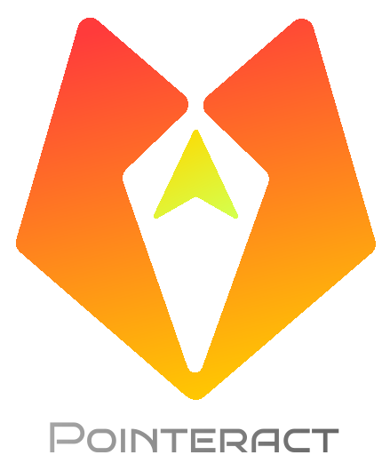

<h1 align="center">
  <a href="https://pointeract.consensia.cc">
    
  </a>
  <br>
</h1>

<h4 align="center"> 🖱️🤏 lightweight, robust and extensible human gesture detector </h4>

<p align="center">
    <a href="https://github.com/hesprs/pointeract/actions">
        
    </a>
    <a href="https://codecov.io/github/hesprs/pointeract">
        
    </a>
    <a href="https://www.codefactor.io/repository/github/hesprs/pointeract">
        
    </a>
    <a href="https://pointeract.consensia.cc">
        
    </a>
    <a href="https://www.npmjs.com/package/pointeract">
        
    </a>
    <a href="https://snyk.io/test/npm/pointeract">
        
    </a>
    <a href="https://bundlejs.com/?q=pointeract%40latest">
        
    </a>
    
    
</p>

<p align="center">
    <a href="https://github.com/hesprs/synthkernel">
        </img>
    </a>
</p>

<p align="center">
    <a href="https://pointeract.consensia.cc/playground">
        <strong>Demo</strong>
    </a> • 
    <a href="https://pointeract.consensia.cc">
        <strong>Documentation</strong>
    </a> • 
    <a href="https://www.npmjs.com/package/pointeract">
        <strong>npm</strong>
    </a>
</p>

## What's Pointeract?

Pointeract is a tiny JavaScript/TypeScript utility library focusing on one thing - handling user interactions with DOM elements, e.g. multitouch and touchpad.

Powered by [SynthKernel architecture](https://hesprs.github.io/researches/synthkernel), Pointeract has achieved a highly _modular, extensible and efficient_ architecture. Its core bundle size is only **1KB** minified + gzipped, functionalities come from also byte-sized modules. It's fully **tree-shakable**, the fewer modules you use, the smaller your bundle is.

## Advantages

- **🐣 Tiny**: With base **1KB** minified and gzipped, **1-2KB** for normal usage.
- **💪 Robust**: Excels at complex gestures where most interaction libraries fail, [Why?](https://pointeract.consensia.cc/development/testing#monkey-test)
- **🧩 Extensible**: Extend Pointeract effortlessly via our module API.
- **🔌 Flexible during Runtime**: Options are updated reactively. Stop/start any module during runtime.
- **🛡️ Safe**: Not modifying the DOM (except the `PreventDefault` module). Meticulous clean up prevents memory leaks.

## Get Started

Install Pointeract using your favorite package manager:

```sh
# npm
npm add pointeract

# pnpm
pnpm add pointeract

# yarn
yarn add pointeract

# bun
bun add pointeract
```

Or include the following lines directly in your HTML file:

```html
<script type="module">
  import { Pointeract } from 'https://unpkg.com/pointeract';
</script>
```

This link ships the latest ESM version by default.

Then simply grab the core class and a module:

```TypeScript
import { Pointeract, Drag } from 'pointeract';

new Pointeract({ element: yourElement }, [Drag])
    .start()
    .on('drag', e => console.log(e));
```

Congratulations! You can now press your mouse or finger to the element and move, the console will log events like a waterfall.

**Read next**: dive into the usage of Pointeract in [Use Pointeract](https://pointeract.consensia.cc/basic/use-pointeract).

## Currently Supported Features

- **Click (Double Click, Triple Click, Quadruple Click, Any Click)**
- **Drag**
- **Swipe (All directions, single / multiple fingers)**
- **Pan and Zoom via Mouse Wheel (`ctrl`/`shift` key binding, touchpad support)**
- **Pan and Zoom via Multitouch (Pan, Pinch)**
- **One-line Prevent Default**
- **Smooth Everything (drag / pan / zoom / any interaction involving numbers)**

Those interactions are shipped via modules, which can be composed from a single drag-and-drop to a canvas app.

Missing your desired interaction? [Write your own module](https://pointeract.consensia.cc/development/custom-modules)!

## How Pointeract Stands Out?

There're already plenty of interaction libraries out there, most famous ones are `d3-drag` + `d3-zoom`, `Interact.js` and `Hammer.js`, but Pointeract is different.

| Criteria                                                                                       |                      Pointeract                       | [D3 Drag](https://github.com/d3/d3-drag) + [D3 Zoom](https://github.com/d3/d3-zoom) |     [Hammer.js](https://hammerjs.github.io)     |         [Interact.js](https://interactjs.io)         |
| :--------------------------------------------------------------------------------------------- | :---------------------------------------------------: | :---------------------------------------------------------------------------------: | :---------------------------------------------: | :--------------------------------------------------: |
| Written in TypeScript?                                                                         |                          ✅                           |                                         ❌                                          |                       ❌                        |                          ✅                          |
| Tree-shakeable?                                                                                |                          ✅                           |                                         ❌                                          |                       ❌                        |                          ❌                          |
| Total Bundle Size (Minified + Gzipped)                                                         | 👑 [3KB](https://bundlejs.com/?q=pointeract%40latest) |          [17KB](https://bundlejs.com/?q=d3-drag%403.0.0%2Cd3-zoom%403.0.0)          | [7KB](https://bundlejs.com/?q=hammerjs%402.0.8) | [28KB](https://bundlejs.com/?q=interactjs%401.10.27) |
| Last Updated                                                                                   |                👑 Actively Maintained                 |                                        2021                                         |                      2015                       |                         2023                         |
| Versatility                                                                                    |        Pointer and Wheel Related + Some Utils         |                      👑 Pointer and Wheel Related + Ecosystem                       |                 Pointer Related                 |        Pointer Related + Comprehensive Utils         |
| Support                                                                                        |      👑 Mouse, Mouse Wheel, Touch, and Touchpad       |                               ⚠️ No Touchpad Support                                |      ⚠️ No Touchpad or Mouse Wheel Support      |        ⚠️ No Touchpad or Mouse Wheel Support         |
| Robust (Passes [Monkey Test](https://pointeract.consensia.cc/development/testing#monkey-test)) |                          ✅                           |                                         ✅                                          |                ❌ Element Jerks                 |         ❌ Element Ignores the Second Touch          |
| Extensible?                                                                                    |                          ✅                           |                                         ❌                                          |                       ❌                        |                          ❌                          |

## Get Involved

This project welcomes anyone that has ideas to improve it.

- [Open a pull request](https://github.com/hesprs/pointeract/compare) for a new module, event standard, documentation update, and so on.
- [Open an issue](https://github.com/hesprs/pointeract/issues/new) if you find a bug or have a feature request.
- [Start a new thread in Discussions](https://github.com/hesprs/pointeract/discussions/new) if you have feature requests or questions want to discuss.
- [Report a vulnerability](https://github.com/hesprs/pointeract/security/advisories/new) if you find one, please do not disclose it publicly.

## Copyright and License

Copyright ©️ 2025-2026 Hesprs (Hēsperus) | [Apache License 2.0](https://www.apache.org/licenses/LICENSE-2.0.html)
